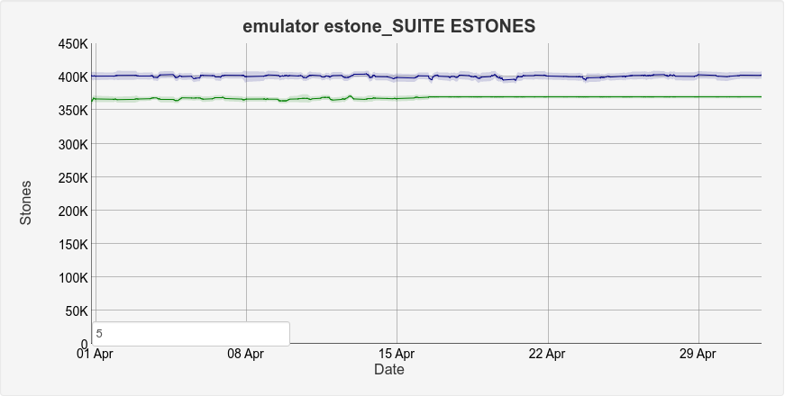
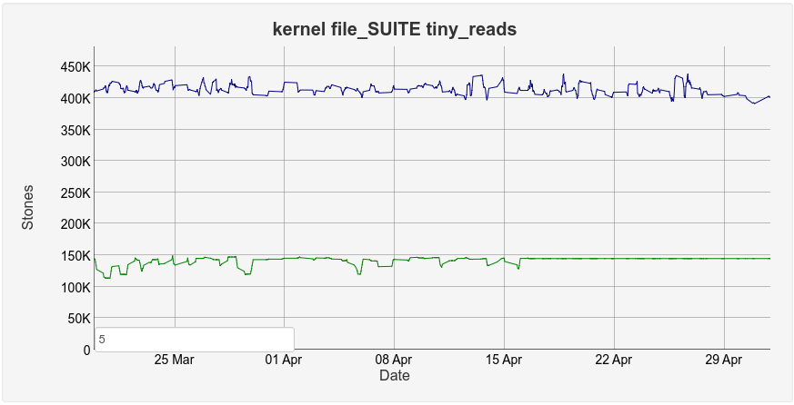
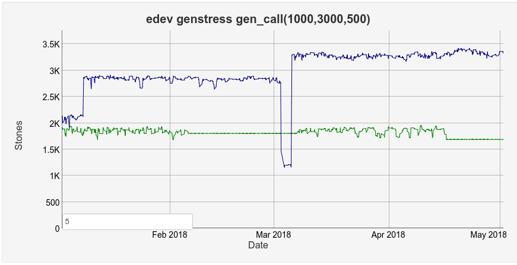

OTP-21 Release Candidate 1 has just been released. I thought that I would go
through the changes that I am the most excited about. Most likely this will
mostly mean features in erts and the core libraries as those are the
changes that I am the most familiar with.

You can download the readme describing the changes here: [OTP 21-RC1 Readme](http://erlang.org/download/otp_src_21.0-rc1.readme).
Or, as always, look at the release notes of the application you are interested in.
For instance here: [OTP 21-RC1 Erts Release Notes](http://erlang.org/doc/apps/erts/notes.html).

# Compiler / Interpreter #

Björn Gustavsson has been doing a lot of work with the compiler and interpreter
the last year while I have been sitting next to him cheering. The largest changes
is part of the OTP-14626 ticket. While working on the
[BEAMJIT](https://www.youtube.com/watch?v=PtgD5WRzcy4) development
I've been looking a lot at the [luajit](http://luajit.org/) project and what
Mike Pall has done both in the JIT but also in the interpreter. Inspired by
this and some other ideas that we got from the BEAMJIT project we decided it was time
to do a major overhaul of the way that the BEAM interpreter is created. Most of the
changes done boil down to decreasing the size of beam code in memory, thus making more
code fit in the L1/L3 caches and in extension making code run faster. We've
decreased the loaded code size by about 20% using our optimizations. This has
translated to about a 5% performance increase for most Erlang code
which is quite amazing. Me or Björn will most likely write more about exactly
what this has entailed in a future blogpost.

Another compiler change that has had quite a large impact (at least in our benchmarks)
is OTP-14505 contributed by José Valim in [PR 1080](http://github.com/erlang/otp/pull/1080).
The change makes the compiler re-write:

    example({ok, Val}) -> {ok, Val}.

to

    example({ok, Val} = Tuple) -> Tuple.

eliminating the extra creation of the tuple. As it turns out this is a quite
common pattern in Erlang code so this will be good for all programs.

An example of this performance gain can be seen in the estone benchmarks SUITE
below. OTP-14626 together with some other compiler and erts improvements have
increased the number of stones from 370000 in OTP-20.3 (the green line), to
400000 in OTP-21 (the blue line). So about 7.5%.

# Erlang run-time system #

There are many changes in the run-time system.

## File handling ##

All file IO has traditionally been handled through a port. In OTP-21 all of the
file IO has been rewritten to use nifs instead, OTP-14256. This was mainly done
in order to run file operation in the dirty IO schedulers. It also had the nice
side-effect of significantly increasing throughput of certain operations.

For instance in the tiny reads benchmark OTP-21 (the blue line) is about 2.8 times
faster than OTP-20.3 (the green line).

Also it is now possible to open device files using file:open, see OTP-11462.

## I/O Polling ##

The entire underlying mechanism for checking for I/O on sockets has been rewritten
and optimized for modern OS kernel polling features. See OTP-14346 and
[I/O polling options in OTP 21]({{ site.baseurl }}/IO-Polling) for more details.

## Distribution ##

It has always been possible to write your own distribution carrier if you want
to if, for instance, you wanted to use [RFC-2549](https://tools.ietf.org/html/rfc2549)
to send your distributed Erlang messages. However you have had to implement it as
a linked-in driver. With the introduction of OTP-14459 you can now use a process
or port as the distribution carrier. So now you can use gen_pigeon instead of having
to call the boost equivalent.

The ability to use processes as distribution carriers is now used by the TLS
distribution. This allows us to not have to jump through several hoops as was done
before increasing the throughput of TLS distribution significantly.

## Process signals ##

When running benchmarks using cowboy and hammering it with connections that
do not use keep-alive, one of the SMP scalability bottlenecks that pop up
is the link lock of the supervisor that supervises all the connections.
The reason why this lock pops up is because when you have a lot of linked
processes, the rb-tree in which the links are stored becomes very large so
the insertion and deletion time increases. In OTP-14589 this has been
changed so that all link and monitor requests now are sent as messages
for the receiving process to take care of. This means that the lock has been
completely removed. Now all signals (be they messages, links, monitors,
process\_info, group\_leader etc) are handled through the same queue.

In addition, OTP-14901 now makes it so that monitor + send signals
are merged into one signal. So the contention is reduced even further
for gen_server:call like functions.

The performance difference is quite significant. The genstress benchmark
seen above OTP-21 (the blue line) has almost doubled in throughput
compared to OTP-20.3 (the green line).

# Logger

OTP-13295 adds a completely new logging framework for Erlang/OTP. It is
inspired by the way that [lager](https://github.com/erlang-lager/lager),
the [Elixir Logger](https://hexdocs.pm/logger/Logger.html) and the [Python
logger](https://docs.python.org/3/howto/logging.html) works.
With logger the logging handlers can intercept the logging
call in the process that does the actual call instead of having to
wait for a message. This opens up all sorts of possibilities of early
rejection of log messages in case of an overload, see [Logger User's Guide](http://erlang.org/documentation/doc-10.0-rc1/lib/kernel-6.0/doc/html/logger_chapter.html#protecting-the-handler-from-overload)
for more details. The user can also add special purpose filters that are run
before the handler is invoked in order to silence or amend log messages in the system.

# Misc

HiPE has finally been fixed by Magnus Lång to use the receive reference optimization
that beam has had for a long time, OTP-14785.

The ftp and tfpt parts of inets have been separated into their own applications
instead of being bundled, OTP-14113.

The rand module has seen a lot of work, adding new features. I'm not sure when or
how the difference is use full, but the theory around this is fascinating, OTP-13764.

The maps module now has an maps:iterator/0 and maps:next/1, OTP-14012.

io_lib:format/3 has been added to limit the output of the functions. This is especially
useful when building logging frameworks as you may get arbitrarily large terms to
format and may want to cut them in order to not overwhelm the system, OTP-14983.

As a final note, I'm not sure if anyone noticed, but as of OTP-20.3, processes that
are in the state GARBING when your system crashes now have stack traces in the
crash dump!!!
